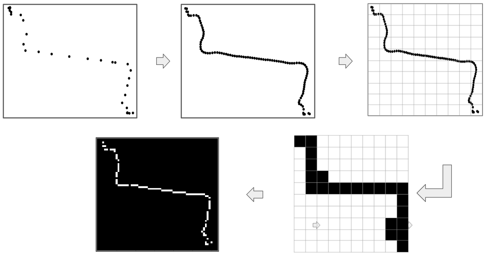
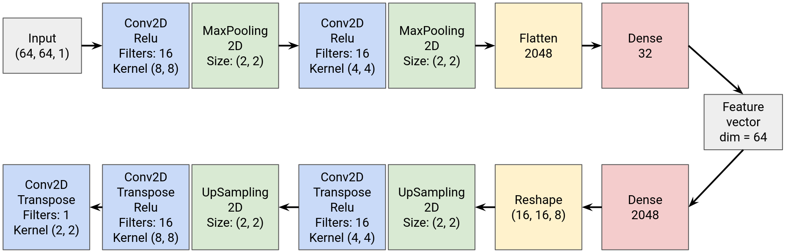
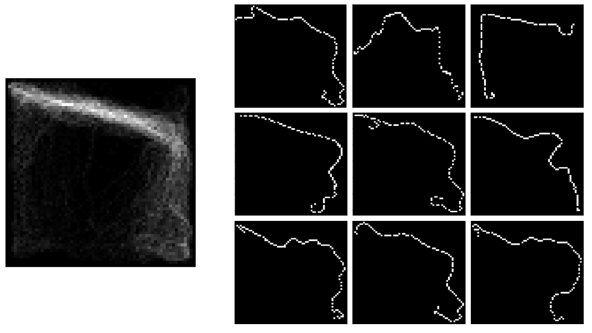
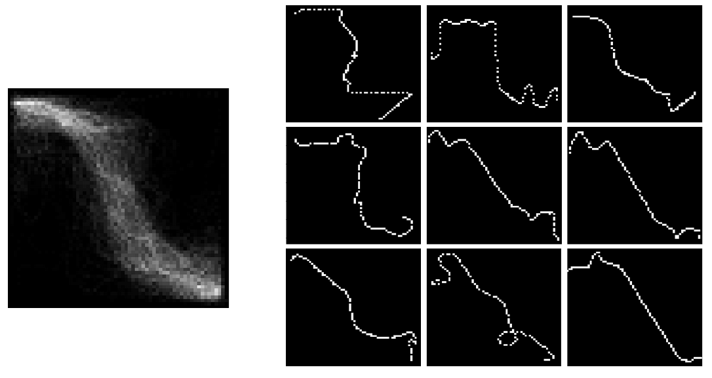

## Trajectory Clustering via CNN autoencoder

Implementation based on the paper "An unsupervised learning method with convolutional auto-encoder for vessel trajectory similarity computation". Trajectory clustering possible applications include: trip recommendation or transportation mode detection. The data used corresponds to taxi trips for all the 442 taxis running in the city of Porto, in Portugal (https://www.kaggle.com/c/pkdd-15-taxi-trip-time-prediction-ii/data). GPS trajectories were converted to images and then fed to a CNN autoencoder.Then, K-means algorithms was used to group the trajectories based on their low dimensional feature vectors.

### Methodology
1. **Step 1**: Apply linear interpolation to the point trajectories. Divide the space into a grid. Apply color only to the grids containing points of the interpolated trajectory. Process is shown in the image below.

2. **Step 2**: Train autoencoder model. Architecture used is shown in the image below.
  
3. **Step 3**: Apply K-means algorithm to create the groups.

### Results
#### Training
26743 samples for train, 11462 samples for test.
Loss: Mean Squared Error
Optimizer: adam
Epochs: 5
Results: loss: 0.0155 , val_loss: 0.0157

#### Clustering
Example groups:
  
  
Left side image represents the sum of all members of the group through superposition. Right side shows individual group members

### Base paper
Liang, Maohan, et al. "An unsupervised learning method with convolutional auto-encoder for vessel trajectory similarity computation." Ocean Engineering 225 (2021): 108803.
